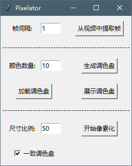

# Video Pixelator

这个项目的目标是将小段视频进行像素化并输出帧图像。

窗口分三部分

- 第一部分用于视频的抽帧，提取出的帧图像保存在子目录 frames 下

- 第二部分用于生成调色盘，并保存调色盘数据在 palette.txt 中，可以手动进行修改后加载

- 第三部分用于对每一帧图像进行像素化操作，像素化之后的图像保存在子目录 frames_pixelated 下

    - 勾选一致调色盘，对于所有帧图像，都使用生成或者加载的调色盘

    - 不勾选一致调色盘，则对于每一帧图像，生成单独的调色盘，严重增加运行时间，适用于场景变化的情况

效果展示：

